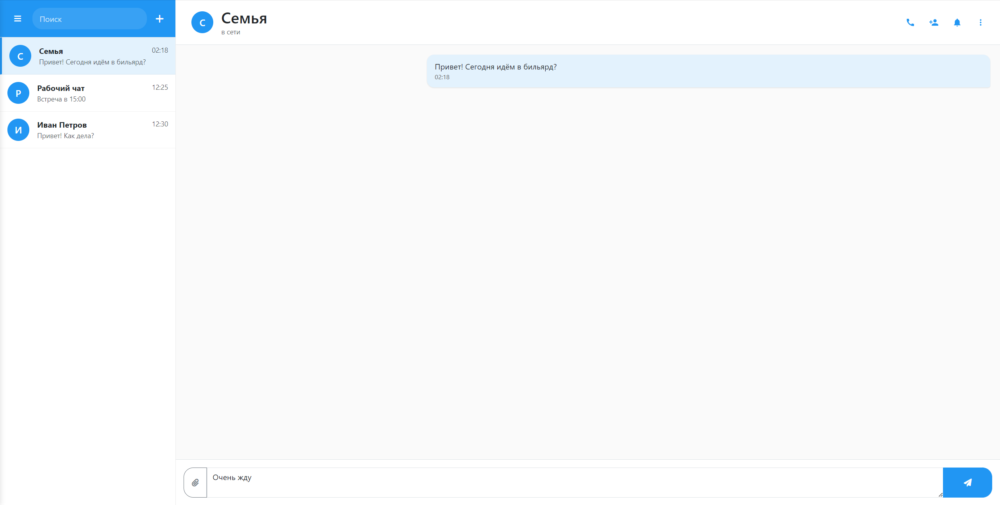

# Telegram Web Client

Неофициальный веб-клиент Telegram с современным пользовательским интерфейсом. Проект создан для демонстрации возможностей создания мессенджер-интерфейсов с использованием современных веб-технологий.

 <!-- Замените на актуальный скриншот -->

## Особенности

- 📁 Боковая панель со списком чатов
- 🔍 Поиск по чатам и сообщениям
- ➕ Кнопка создания нового чата
- 💬 Область переписки с историей сообщений
- 📎 Меню прикрепления файлов (фото, видео, документы)
- ⚙️ Контекстное меню опций чата
- ✉️ Система отправки сообщений
- 📱 Адаптивный дизайн (Bootstrap 5)

## Технологии

- **Bootstrap 5** - сетка и базовые компоненты
- **Font Awesome 6** - векторные иконки
- **Vanilla JavaScript** - интерактивность
- **CSS3** - кастомные стили и анимации
- **HTML5** - семантическая разметка

## Установка и запуск

1. Клонировать репозиторий:
```bash
git clone https://github.com/aver005/telegram-web.git
